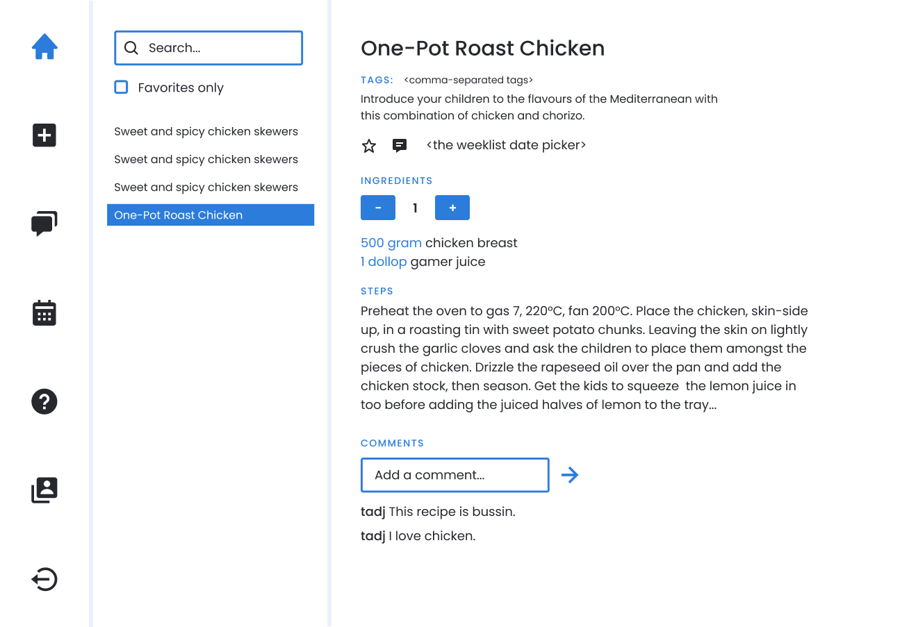
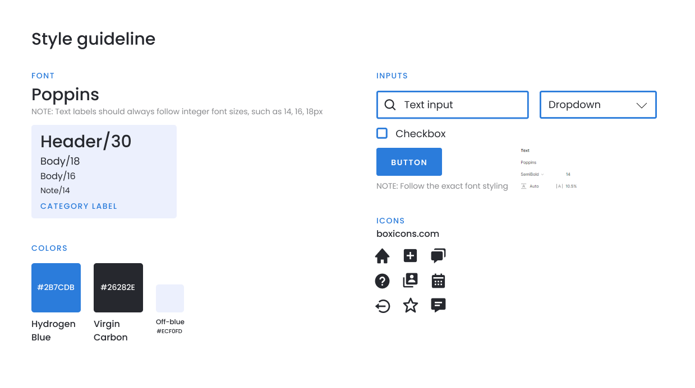
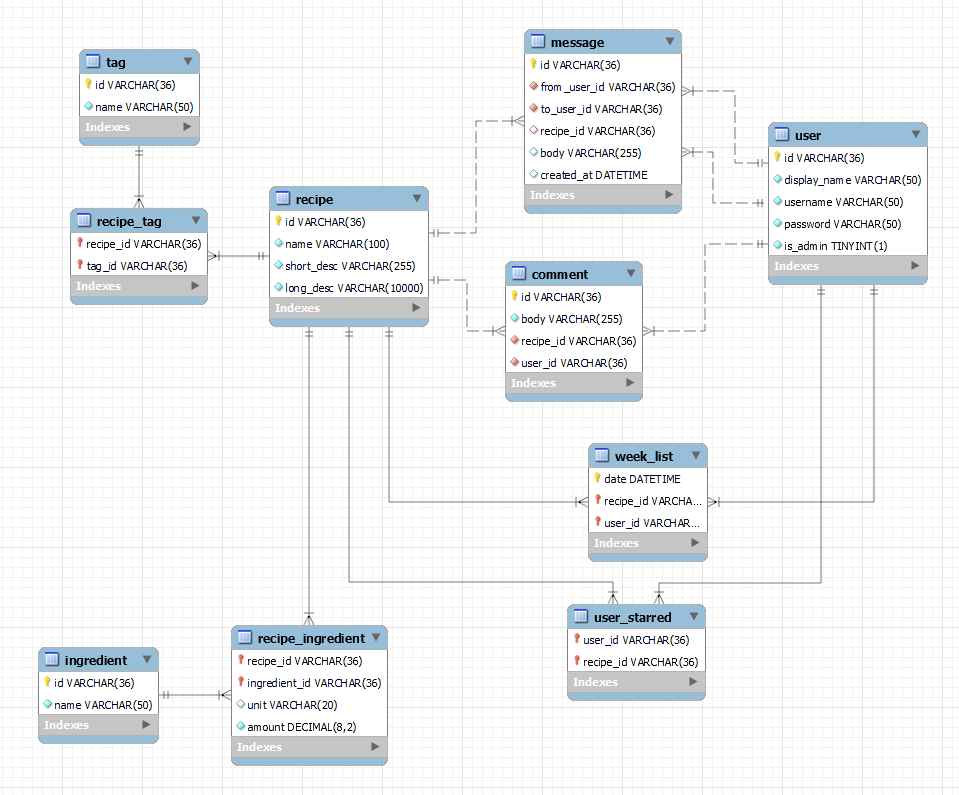

# Hydrogen Group

## Members

- Tadj Cazaubon
- William Issac Tesfagiorgish
- Rashad Abbas
- Mateusz Sowinski-Smetny
- Amirreza Dehdari

## Application structure and overview
- [Backend, DB, and Entity definitions](./app/src/main/java/cookbook/db/)
- [User Interface](./app/src/main/java/cookbook/frontend/)
- [Utils](./app/src/main/java/cookbook/util/)

Additional libraries included in build.gradle:
- `com.moandjiezana.toml:toml4j:0.7.2` - used for the credentials file

Other third-party resources used:
- [Box Icons](https://boxicons.com)
- [The Poppins font](https://fonts.google.com/specimen/Poppins)


## Contribution guidelines and developmental processes
See the [CONTRIBUTING.md](CONTRIBUTING.md) file.

## Workflow

A generic Agile workflow was followed for the duration of the development process. Daily standup meetings however were essentially phased out in favour of written DSUs automated to be sent to and filled out by each member in the morning. This was done, not only for ease of use and documentation, but also to accomodate our members in other timezones as well as in an effort to promote asynchronous work.
A standardized structure for our workflow and interaction with gitlab was created within the first days of development by our then scrum master motivated by common industry standards and the nature of the project. This was followed throughout development and can be seen in the [CONTRIBUTING.md](CONTRIBUTING.md) file.

## Design Iterations

The application has gone through three main design iterations, with only two being implemented.

In the beginning of the project, the lack of a concrete understanding of the possible technological limitations prevented a standardized design from being developed. For the majority of the project duration, the various user interfaces were implemented on a "Content First, Design Second" basis.

Once the bulk of the required features has been implemented, a standardized branding and design system was established. Below is an example of one of the panels in the final design:



The full design file can be found in [this Figma link](https://www.figma.com/file/uKN7vCt66IYlcZdX5zwOuI/Cookbook-Design?node-id=367%3A110).

Once the design has been implemented to some degree, a Design QA has been conducted in an effort to ensure that the implementation of the design matches with the actual design. The results of that QA are accessible under [this Figma link](https://www.figma.com/file/uKN7vCt66IYlcZdX5zwOuI/Cookbook-Design?node-id=480%3A215). *Note:* It might be necessary to log in to Figma to be able to see the comments describing the QA issues.

A general timeline of the design iterations throughout the project can be viewed in the [DesignProgression.pdf](DesignProgression.pdf) file.

## Branding and style guidelines

In an effort to standardize our application's branding and streamline the creation of the designs, we established a Style Guideline, which highlights the most important atomic components of our designs.




## Architecture

Taking inspiration from other programming language ecosystems and ORMs (in particular, TypeORM in the TypeScript ecosystem), we developed an extendible abstraction for our database interactions. For ease of development, we createda  python script containing the [database schema definition](./app/src/main/java/cookbook/db/createSchema.py/), as well as [a script to seed the database](./app/src/main/java/cookbook/db/entities/) with example data for development and testing purposes. The various database tables have been represented as [Entity classes](./app/src/main/java/cookbook/db/entities/). Conversely, the operations that we defined for these entities have been encapsulated in their own [Service classes](./app/src/main/java/cookbook/db/services/), drawing inspiration from REST API application structures and common practices (in particular, Nest.js in the JavaScript ecosystem).

In short, to promote separation of concerns, we separated our application into two main modules, the backend and the frontend. The frontend's main prupose is to define the various UI functions. To allow the frontend to display data from the database (as well as modify the data), it communicates with the backend through the aforementioned services.

The final database schema can be observed in the following diagram:



### Seed/Drop Database

*Mainly used for development and testing*. You may use this functionality to migrate the database to the most recent schema and seed it with example data.

The application can be run with:
```bash
.\gradlew run
```
Arguments can be specified in the form:  
```bash
.\gradlew run --args="space separated arguments here"
```  
These arguments are:  
```drop``` -- Drops the whole schema before migrating it again.  
```seed``` -- Seeds the database with data.

### Database Config

To specify the username and password of the local databse for the application, simply edit the [cfg.toml](cfg.toml) file with the appropriate credentials. The Database Manager uses these credentials for all subsequents requests to the database.  
Two default logins have been provided for use/testing:  
| Username | Password | Role  |
|----------|----------|-------|
| user     | user     | User  |
| admin    | admin    | Admin |
